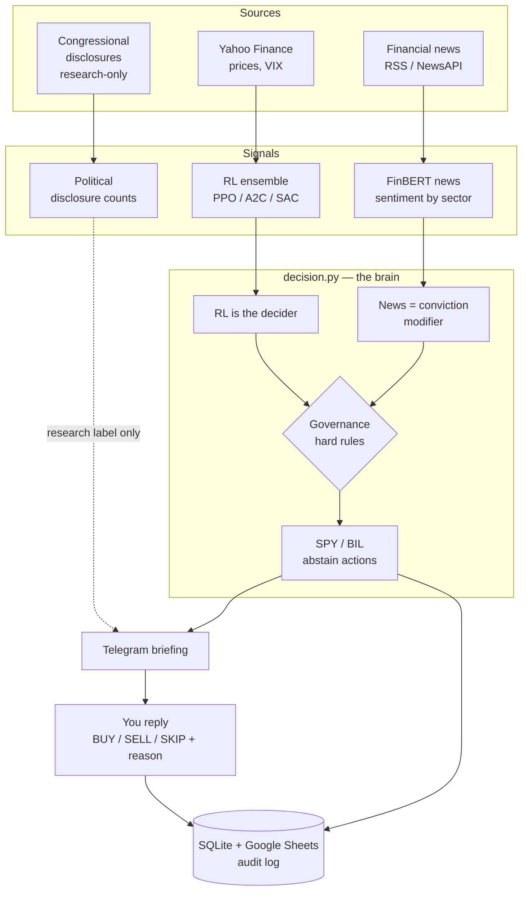

# Sector Command — System Ecosystem Overview

**A unified quantitative research pipeline spanning seven repositories**, connecting calculus-based business optimization, statistical event studies, transformer NLP, and deep reinforcement learning into a single decision-and-documentation system.

Built by [Cameron Camarotti](https://github.com/cameroncc333) · Founder, [All Around Services](https://allaroundservice.com)

---

## What this document is

This is the map. Each repository below is independent and runs on its own — but they were designed as one research program. This repo (`sector-command-live`) is the **orchestrator** that consumes their outputs, adds a live news-sentiment signal, and routes decisions to a Telegram interface with full audit logging. Nothing here replaces the existing repos; it sits on top of them.

> **Design principle:** the RL ensemble is the brain. News sentiment is a conviction *modifier*. VIX/regime can force defensive abstain actions (SPY/BIL). Congressional disclosures are logged as **research-only context and never drive a trade**. A governance layer holds hard rules the system cannot override.

---

## The seven repositories

| Repository | Domain | Core technique | Role in pipeline |
|---|---|---|---|
| `aas-pricing-model` | Business cost optimization | Partial-derivative cost function, Monte Carlo | Origin of the mathematical method (∂Cost/∂φ) |
| `fed-rate-sector-analysis` | Macro policy → markets | FOMC event study, 30/60/90-day windows | Establishes rate-decision sector sensitivity |
| `equity-sector-analyzer` | Live market dashboard | 30+ risk metrics, Black-Scholes Greeks, Fama-French 5-factor | Signal definitions reused by the RL feature set |
| `fomc-sentiment-analyzer` | AI sentiment research | FinBERT NLP, Benjamini-Hochberg FDR correction | Origin of the NLP method reused in the news feeder |
| `algo-trading-system` | Rules-based backtest | Composite factor scoring, walk-forward validation | Baseline the RL agents must beat |
| `rl-portfolio-optimizer` | RL capstone | PPO / A2C / SAC, regime-adaptive reward | Produces the daily ensemble signal |
| **`sector-command-live`** (this repo) | **Live orchestration** | **News sentiment + governance + Telegram + audit log** | **Ties it together, texts you, documents decisions** |

---

## Data flow

---

## The mathematical through-line

The same two methods recur across every repo, applied to progressively harder domains:

- **Partial derivatives** — crew-dispatch optimization (`∂Cost/∂φ`) in the pricing model → option Greeks (`∂V/∂S`, `∂V/∂σ`) in the equity analyzer → policy gradients in the RL agents.
- **Monte Carlo simulation** — 10,000-scenario pricing risk → portfolio projection fans → bootstrap confidence intervals on RL Sharpe ratios.

The narrative: *find a system, understand why it behaves the way it does, build a tool to make better decisions within it, and document the reasoning so it can be evaluated over time.* The crew-fatigue factor (φ) is a real-world proxy for human-capital risk; the seasonal-demand coefficient (κ) is a proxy for cyclical beta. The physical economy and the financial economy turn out to be the same optimization problem under uncertainty.

---

## Honest scope

This is a research-and-documentation system, not a money machine. It runs in **paper mode** by default and never auto-executes. At the intended account size the trading P&L is immaterial; the value is the rigor of the decision process and the audit trail it produces. Limitations are documented per-repo and in `RESEARCH_JOURNAL.md`.

*Not financial advice. Built for analytical and educational purposes.*
